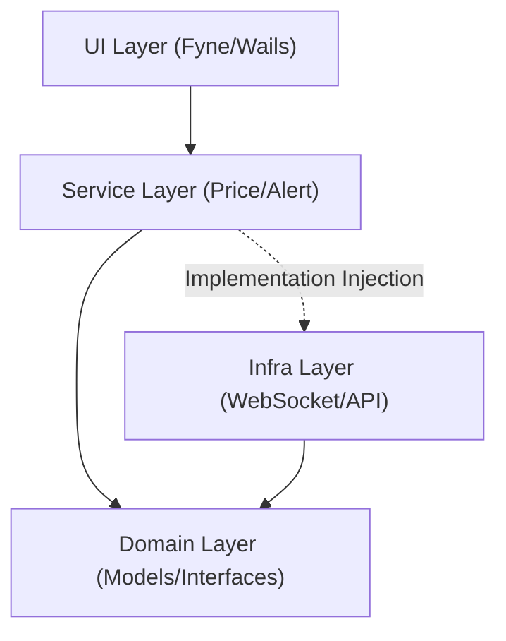

# CryptoMonitor 개발 워크플로우

> ⚠️ 이 문서를 읽지 않고 코딩하면 **실패한 작업**으로 간주합니다.

## 💡 설계 및 개발 원칙 (Philosophy & Principles)

### 🥇 핵심 구조 (Core Principles)
- **의존성 역전 (DIP)**: 서비스 로직은 인터페이스를 통해 통신하며, 인프라 구현체에 의존하지 않는다.
- **최소 종속성 (Minimalism)**: 외부 라이브러리 사용을 최소화하고, 직접 구현 가능한 로직은 표준 라이브러리를 우선 활용한다.
- **상태 관리**: 패키지 레벨 전역 변수 사용을 금지하고 생성자를 통해 필요한 객체를 주입받는다.

### 🧠 개발 지침 (Proverbs)
- **단순성 우선**: 기능 추가보다 구조의 명확함을 중시한다.
- **실용적 추상화**: 미래를 위한 과도한 추상화를 지양하고, 테스트와 유지보수가 필요한 시점에 도입한다.
- **코드 정제**: 불필요한 코드와 복잡성을 유발하는 로직은 주기적으로 제거한다.

## 🚫 금지 및 제한 사항 (Restrictions)
- **유틸리티 제한**: `utils`, `helper` 모듈에 비즈니스 로직(계산, 판단) 삽입 금지. 순수 연산 함수(Pure Functions)는 Core/Domain 레이어에 배치한다.
- **API 혼용 금지**: 레이어 간 소통 시 내부 모델과 외부 API 모델을 엄격히 분리한다.

## 🤖 AI 협업 지침 (Collaboration)
AI는 전문가로서 시스템의 안정성을 보장하며 다음 규칙을 준수한다.

### 1. 자율 판단 허용 범위
- 기능 구현에 필수적인 보조 코드 (에러 처리, 타입 정의 등)
- 보안/안정성을 위해 반드시 필요한 검증 로직
- 코드 품질 및 전문가 아키텍처 유지를 위한 내부 리팩토링

### 2. 자율 판단 시 필수 고지 (3 Core Explanations)
자율적으로 코드를 추가/수정했을 경우 반드시 다음 내용을 설명해야 한다:
1. **왜 만들었는가**: 이 코드가 없으면 발생하는 실제 기술적 문제
2. **왜 지금 필요한가**: 현재 마일스톤 단계에서 생략할 수 없는 이유
3. **제거하면 어떻게 되는가**: 삭제 시 시스템에 미치는 영향 범위

### 3. 엄격 금지 사항 (Strict Prohibitions)
- **추측 금지**: 라이브러리 API를 추측으로 사용하지 않는다. 반드시 **Context7**을 통해 문서를 확인한다.
- **기억 의존 금지**: 파일 내용을 기억에 의존하여 수정하지 않는다. 수정 전 반드시 **`view_file`**을 실행한다.
- **히스토리 의존 금지**: 이전 대화 내용만 믿고 최신 파일 확인을 생략하지 않는다.
- **임의 명세 추가 금지**: 명세에 없는 기능을 마치 있는 것처럼 멋대로 구현하지 않는다.
- 설명 없는 신규 기능 추가 및 요청하지 않은 UI 요소 추가 금지.
- 승인된 설계 명세를 벗어난 독단적 구조 변경 금지.

## 🤖 AI 친화적 코드 작성 규칙 (AI-Friendly Standards) 🎯
> **목표**: AI가 코드를 즉각 이해하고, 환각 없이 정확하게 수정할 수 있는 구조 유지

1. **명시적 컨텍스트 (Explicit over Implicit)**
   - 마법 같은(Magic) 기능이나 암시적인 로직을 지양하고, 읽는 즉시 의도가 파악되도록 명시적으로 작성한다.
2. **함수 원자성 (Atomic Functions)**
   - 하나의 함수는 하나의 명확한 작업만 수행하며, 적절한 길이를 유지하여 AI의 컨텍스트 윈도우 부담을 줄인다.
3. **일관된 주석 패턴 (Standardized Comments)**
   - 모든 중요 타입과 함수에는 정규화된 주석을 달아 AI가 RAG나 코드 분석 시 정확한 메타데이터를 얻게 한다.
4. **결합도 분리 (Decoupling)**
   - 인터페이스를 적극 활용하여, AI가 전체 시스템을 건드리지 않고도 특정 모듈만 정확히 교체할 수 있게 한다.

## 🎯 코드 품질 4대 원칙 (Standard)
- **낮은 결합도**: 모듈 간 의존성 최소화, 인터페이스로 소통.
- **높은 응집도**: 하나의 모듈은 하나의 책임만 (SRP).
- **명확한 레이어**: Domain, Service, Infra, UI 역할의 엄격 분리.
- **일관된 패턴**: 전체 프로젝트에서 동일한 구현 방식과 스타일 유지.

---


## 🛠 환경 설정 및 실행 (Getting Started)

```bash
# 1. 모듈 의존성 다운로드
go mod download

# 2. 로컬 설정 파일 준비 (템플릿 복사 후 실제 키 입력)
cp configs/config.example.yaml configs/config.yaml

# 3. 빌드 및 실행
go build -o cryptomonitor ./cmd/app
./cryptomonitor
```

## 🔴 필수 절차

### 개발 전 (Before Coding)
1. `CHANGELOG.md` 확인 - 최근 변경 내역
2. `API_REFERENCE.md` 확인 - 현재 타입/함수 구조
3. **단계별 개발 (Incremental Development)**: 한 번에 방대한 기능을 구현하지 않고, 검증 가능한 단위로 나누어 코딩 및 확인.
4. **Sequential Thinking MCP 활용** - 복잡한 작업은 단계별 사고 정리


### MCP 활용 (복잡한 작업 시)

**Sequential Thinking** - 단계별 사고 정리
```
사용 시점:
- 새로운 모듈/파일 설계
- 버그 원인 분석
- 아키텍처 결정
- 여러 파일에 걸친 수정
```

**Context7** - 라이브러리 문서 조회
```
사용 시점:
- 새 라이브러리 사용법 확인 (예: Fyne, gorilla/websocket)
- API 사용 예제 검색
- 라이브러리 버전별 차이 확인

사용법:
1. resolve-library-id로 라이브러리 ID 조회
2. query-docs로 문서 검색
```

### 개발 후 (After Coding)
// turbo-all
4. `go mod tidy` 실행 (의존성 정리)
5. `go fmt ./...` 실행 (스타일 교정)
6. `go vet ./...` 실행 또는 `golangci-lint run` (정적 분석)
7. `go test ./...` 실행 (유닛 테스트 필수 통과 ⚠️)
8. `go build ./...` 실행 (최종 빌드 검증)
9. `CHANGELOG.md` 업데이트
10. `API_REFERENCE.md` 업데이트 (새 타입/함수 추가 시)

---

## 📋 코딩 규칙

### 🛡️ 안정성 및 보안 (Stability & Security) ⚠️
- **재연결 (Resilience)**: WebSocket/API 연결 끊김 시 Panic을 금지하며, **지수 백오프(Exponential Backoff)** 알고리즘을 통한 자동 재연결 로직을 필수 구현한다.
- **비밀 정보 관리 (Secrets)**: API Key 등 민감 정보는 절대 코드나 Git에 포함하지 않는다. 환경 변수(ENV)를 최우선으로 하며, `.gitignore` 처리된 설정을 보조로 사용한다.
- **테스트 강제 (Test-Driven)**: 특히 `Domain` 레이어의 수식 및 연산 로직은 반드시 유닛 테스트(`*_test.go`)를 동반하여 숫자의 무결성을 입증해야 한다.

### 💎 개발 가이드 (Best Practices)

1. **Decimal 연산 책임**
   - **Infra Layer**: 데이터 수집 및 파싱(`string` -> `Decimal`) 담당.
   - **Domain/Service Layer**: 가격/프리미엄 등 모든 비즈니스 수식 연산 수행.

2. **Context 기반 로깅**
   - 모든 로그 출력 시 `slog.InfoContext(ctx, ...)`를 사용하여 실행 문맥을 유지한다.

3. **Config 불변성**
   - 설정은 시작 시 로드하며, 이후 실행 중에는 수정하지 않는다(Read-Only).

### 명명 규칙
- **패키지명**: 소문자 (예: `priceservice` ❌ → `service` ✅)
- **타입명**: PascalCase (예: `MarketData`, `Ticker`)
- **함수명**: PascalCase (exported), camelCase (unexported)
- **파일명**: `snake_case.go` (예: `upbit_worker.go`)

**금지 목록:**
| 금지 | 대안 | 이유 |
|------|------|------|
| `5d`, `10d` | `historyDays`, `lookbackPeriod` | 매직넘버 |
| `p`, `val`, `arg` | `price`, `value`, `argument` | 모호함 |
| `instId`, `baseCoin` | `symbol` | 내부 통일 |
| `raw`, `tmp`, `temp` | 실제 의미 명시 | 의도 불명확 |

### 숫자 원자성 (Financial Standard) ⚠️

> **핵심: 거래소가 준 데이터를 왜곡하지 않는다**

```go
// ✅ 올바름: string → Decimal 직접 변환
price, _ := decimal.NewFromString("42000.50")

// ❌ 틀림: float 중간 변환
f, _ := strconv.ParseFloat("42000.50", 64)
price := decimal.NewFromFloat(f)  // 정밀도 손실
```

**원칙:**
1. **float 금지**: `decimal.Decimal` 또는 `string` 사용
2. **원본 보존**: API 문자열 그대로 Decimal 변환
3. **후행 0 유지**: precision 필드에 별도 저장
4. **임의 반올림 금지**: View 직전까지 원본 유지

### 에러 처리
```go
// 좋음
if err != nil {
    return fmt.Errorf("failed to connect: %w", err)
}

// 나쁨 (panic 금지)
if err != nil {
    panic(err)
}
```

---

### 🏗 시각적 아키텍처 (Visual Architecture)



### 📐 레이어별 역할 및 의존성 규칙
- **Domain**: 다른 레이어 의존 금지 (최상위 순수성). 핵심 모델 및 인터페이스 정의.
- **Service**: Domain에만 의존. Infra는 인터페이스로만 접근하여 비즈니스 유스케이스 조율.
- **Infra**: Domain/Service 인터페이스 실제 구현. 외부 시스템(API)과의 접점 담당.
- **UI**: Service, Domain 의존. 직접 연산이나 API 통신 없이 데이터 표시 및 사용자 인터랙션 담당.

**작업 순서:**
1. Domain (모델) → 2. Service (인터페이스/비즈니스) → 3. Infra (구현) → 4. UI (표시)

### 📂 상세 프로젝트 구조 (Project Structure)
- `cmd/app`: 애플리케이션 엔트리포인트 및 부트스트래핑
- `internal/domain`: 핵심 비즈니스 모델 및 인터페이스 (Pure Logic)
- `internal/service`: 비즈니스 유스케이스 및 유동적인 데이터 흐름 조율
- `internal/infra`: 외부 API, WebSocket, 설정 파일 연동 (Implementation)
- `internal/ui`: 사용자 인터페이스 (Fyne/Wails) 레이어
- `configs`: YAML 기반 환경 설정 (비밀 정보 제외)
- `.agent/workflows`: AI 핵심 협업 지침서


---

## 📍 로드맵 (Logic First)

> GUI 전에 콘솔로 로직 검증

### Phase 1: 기반 ✅
- [x] Domain (`Ticker`, `MarketData`, `AlertConfig`)
- [x] Service (`PriceService`)
- [x] 문서화

### Phase 2: WebSocket ⏳
| 순서 | 작업 | 검증 |
|------|------|------|
| 2-1 | `upbit_worker.go` | 콘솔 출력 |
| 2-2 | `bitget_worker.go` | 콘솔 출력 |
| 2-3 | `bitget_worker.go` (Futures) | 콘솔 출력 |

### Phase 3: 환율 API ⏳
- [ ] Yahoo Finance 연동
- [ ] 김치 프리미엄 계산 검증

### Phase 4: UI ⏳
- [ ] Fyne/Wails 선택
- [ ] 테이블 뷰 구현

---

## 📂 문서 구조

| 문서 | 용도 |
|------|------|
| `CHANGELOG.md` | 변경 이력 (핵심) |
| `API_REFERENCE.md` | 타입/함수 명세 |
| `README.md` | 프로젝트 소개 |

---

> Python 원본: `../CryptoMonitor/`
