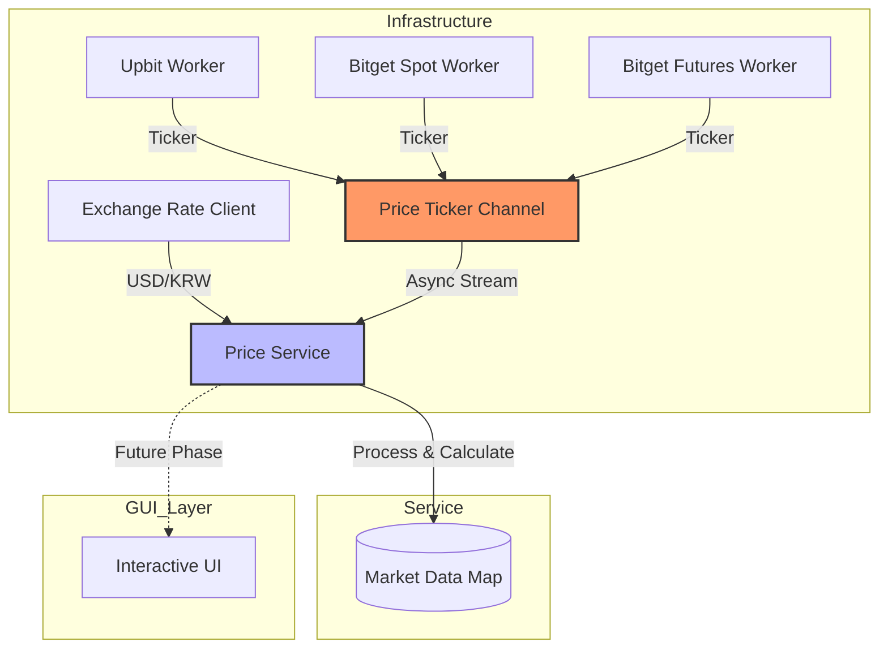

# 🚀 CryptoMonitor

실시간 암호화폐 시세 모니터링 및 김치 프리미엄 계산을 위한 고성능 Go 백엔드 엔진입니다.

## 📋 개요 (Overview)

CryptoMonitor는 업비트(Upbit)와 비트겟(Bitget)의 WebSocket API를 연동하여 실시간 시세를 수집합니다.

## 🔄 시스템 워크플로우 (Workflow)



## ⚙️ 설정 가이드 (Configuration)

`configs/config.yaml` 파일을 통해 시스템을 제어합니다.

```yaml
api:
  upbit:
    symbols: ["BTC", "ETH"] # KRW- 제외 코드
  bitget:
    symbols:
      BTC: "BTCUSDT"        # 통합기호 : 비트겟 ID
```

## 🧪 데이터 모델 (Domain Models)

### `Ticker`
각 거래소로부터 수신되는 가공된 공통 시세 데이터입니다.
- `Symbol`: 코인 이름 (예: BTC)
- `Price`: 현재가 (Decimal)
- `Exchange`: 소속 거래소 (UPBIT, BITGET_S, BITGET_F)
- `Precision`: 가격 표시 소수점 자리수

### `MarketData`
`PriceService`에서 관리되는 최종 통합 정보입니다.
- `Upbit`: 업비트 시세 정보
- `BitgetS`: 비트겟 현물 정보
- `BitgetF`: 비트겟 선물 정보
- `Premium`: 김치 프리미엄 (%)

## 🚩 주요 마일스톤 (Milestones)

- **v1.0.1 (Current)**: 비동기 시세 파이프라인, 동적 심볼 설정, 봇 감지 회피(User-Agent) 및 안정성 강화.
- **v1.0.0**: 프로젝트 초기 릴리스 및 업비트/비트겟 웹소켓 기본 연동.

## 🛠️ 개발 문서

- [시스템 아키텍처 (Architecture)](./docs/ARCHITECTURE.md): 계층 구조 및 비동기 데이터 흐름
- [기술 명세서 (Specifications)](./docs/SPECIFICATIONS.md): API, 테스트, 모니터링 및 향후 로드맵

---
*본 프로젝트는 Advanced Agentic Coding 실습의 일환으로 고도화되었습니다.*
